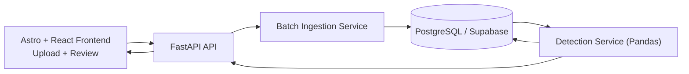

# Fraud Pattern Analyzer Architecture

## Overview

This project is designed as a compact full-stack fraud analysis platform with a strong backend
focus. The primary product goal is to ingest anonymized transaction records, preserve
`source_partition` isolation, and surface suspicious transaction patterns through a simple web
interface.

## System Diagram

## Components

### Frontend

- Astro application with a React client dashboard
- Source organized into:
  - `src/pages` for Astro routes
  - `src/components` for React UI sections
  - `src/lib` for API and export helpers
  - `src/styles` for shared styling
- Built static assets served by FastAPI from `frontend/dist`
- Upload form for CSV files and configurable pipeline controls
- Results dashboard showing:
  - partitions processed
  - records processed
  - total alerts
  - top triggered fraud rules
  - per-partition alert tables

### API Layer

- `POST /api/analyze/upload`
  - accepts a CSV file and runtime analysis settings
  - validates file shape and launches the fraud pipeline
- `GET /api/health`
  - service health endpoint
- `GET /api/partitions`
  - list stored source partitions
- `GET /api/partitions/{source_partition}/summary`
  - recompute and fetch a single partition summary

### Ingestion Layer

- Reads CSV records using Pandas
- Normalizes column names and required fields
- Enforces required transaction shape:
  - `transaction_id`
  - `account_id`
  - `merchant_id`
  - `amount`
  - `event_ts`
- Applies a form-provided `source_partition` when the source file omits one
- Splits the dataset into configurable batch sizes
- Retries transient failures with bounded backoff before surfacing an error

### Persistence Layer

Database tables:

- `transactions`
  - stores normalized transaction history
  - unique on `source_partition + transaction_id`
- `fraud_alerts`
  - stores generated fraud signals
  - unique on `source_partition + transaction_id + rule_name + window_hours`

The application is written against standard PostgreSQL using SQLAlchemy, which makes it work
equally well with a direct PostgreSQL instance or Supabase's managed Postgres offering.

### Detection Layer

The detection layer loads partition-scoped histories into Pandas DataFrames and computes alerts
within configurable rolling windows.

Current rules:

1. `velocity_spike`
   Flags accounts whose transaction count inside the active time window crosses the configured
   threshold.
2. `amount_spike`
   Flags accounts whose transaction amount is unusually large relative to their recent median or
   z-score baseline inside the active time window.

## Partition Isolation Strategy

Partition isolation is central to the design.

- Every transaction and every alert is stored with a `source_partition`.
- Transaction uniqueness is scoped per partition, not globally.
- Detection queries only read the partition requested for analysis.
- Alerts are recalculated and persisted per partition, preventing one tenant's behavior from
  affecting another tenant's risk baseline.

This design mirrors multi-tenant fraud analytics environments where cross-tenant contamination
would create false positives and privacy concerns.

## Runtime Flow

1. User uploads a CSV batch.
2. API validates the request and reads the file bytes.
3. `IngestionService` parses and normalizes records.
4. `FraudRepository` persists new transactions in batches.
5. `DetectionService` loads transaction history for each partition found in the upload.
6. Fraud rules produce alert records with scores, severities, and rule details.
7. Alerts are stored in `fraud_alerts` and returned in the API response.
8. Frontend renders partition-level summaries and suspicious transaction rows.

## Configuration

Runtime settings are controlled through environment variables:

- `DATABASE_URL`
- `BATCH_SIZE`
- `MAX_RETRIES`
- `RETRY_BACKOFF_SECONDS`
- `TIME_WINDOWS_HOURS`
- `ZSCORE_THRESHOLD`
- `VELOCITY_THRESHOLD`
- `AMOUNT_RATIO_THRESHOLD`

This allows the same codebase to point at:

- local Docker PostgreSQL
- Supabase PostgreSQL
- a staging or production managed Postgres cluster

## Testing Strategy

PyTest coverage uses isolated SQLite databases for fast local execution while production targets
PostgreSQL-compatible databases.

Covered scenarios:

- ingestion retry behavior
- partition-required validation edge cases
- amount spike and velocity spike detection
- partition isolation regression behavior
- pipeline summary integration

## Deployment Notes

### Local

- Run PostgreSQL through the included Docker Compose file
- Build the frontend with `npm run build` from `frontend/`
- Start FastAPI with Uvicorn
- Use the Astro static build served by the API

### Supabase

- Provision a Supabase project
- Copy the project Postgres connection string into `DATABASE_URL`
- Build the Astro frontend and ship the generated `dist` assets alongside the API container
- Run the FastAPI app on a small VM or container host
- Keep the frontend bundled with the API for a simple single-service deployment

